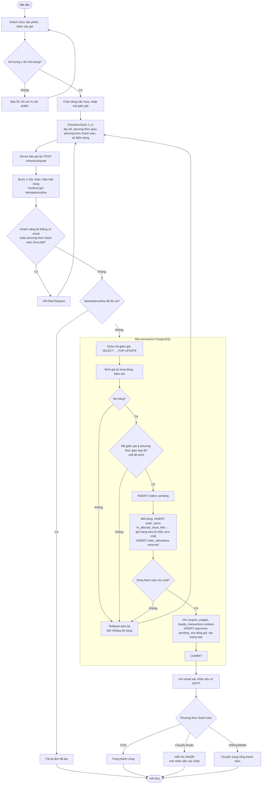

# Sơ đồ hoạt động – Đặt hàng

Căn cứ: `frontend/src/app/(shop)/cart`, `checkout`; `backend/src/modules/orders/orders.service.ts` (`create`, `placeOrder`); `pricing.service.ts`.

```mermaid
flowchart TD
  start([Bắt đầu]) --> A[Khách chọn sản phẩm, thêm vào giỏ]
  A --> B{Số lượng ≤ tồn khả dụng?}
  B -- Không --> B1[Báo lỗi 'chỉ còn N sản phẩm'] --> A
  B -- Có --> C[Chọn dòng cần mua, nhập mã giảm giá]
  C --> D[Checkout bước 1–3:<br/>địa chỉ, phương thức giao,<br/>phương thức thanh toán, số điểm dùng]
  D --> E[Server báo giá lại: POST /checkout/quote]
  E --> F[Bước 4 Xác nhận: bấm Đặt hàng<br/>frontend gửi idempotencyKey]
  F --> G{Khách vãng lai không có email<br/>hoặc phương thức thanh toán chưa bật?}
  G -- Có --> G1[400 Bad Request] --> D
  G -- Không --> H{idempotencyKey đã tồn tại?}
  H -- Có --> H1[Trả lại đơn đã tạo] --> Z
  H -- Không --> T

  subgraph T[" Một transaction PostgreSQL "]
    direction TB
    T1[Khóa mã giảm giá: SELECT … FOR UPDATE] --> T2[Định giá lại từng dòng, kiểm tồn]
    T2 --> T3{Đủ hàng?}
    T3 -- Không --> TX[Rollback toàn bộ<br/>400 'Không đủ hàng']
    T3 -- Có --> T4{Mã giảm giá & phương thức giao hợp lệ?<br/>chế độ strict}
    T4 -- Không --> TX
    T4 -- Có --> T5[INSERT orders: pending]
    T5 --> T6[Mỗi dòng: INSERT order_items<br/>fn_allocate_stock_fefo → giữ hàng theo lô HSD sớm nhất<br/>INSERT order_allocations reserved]
    T6 --> T7{Dòng flash sale còn suất?}
    T7 -- Không --> TX
    T7 -- Có --> T8[Ghi coupon_usages, loyalty_transactions redeem<br/>INSERT payments pending, xóa dòng giỏ, tạo thông báo]
    T8 --> T9[COMMIT]
  end

  TX --> D
  T9 --> I[Gửi email xác nhận nếu có SMTP]
  I --> J{Phương thức thanh toán}
  J -- COD --> K1[Trang thành công]
  J -- Chuyển khoản --> K2[Hiển thị VietQR<br/>chờ nhân viên xác nhận]
  J -- VNPay/MoMo --> K3[Chuyển sang cổng thanh toán]
  K1 & K2 & K3 --> Z([Kết thúc])
```
