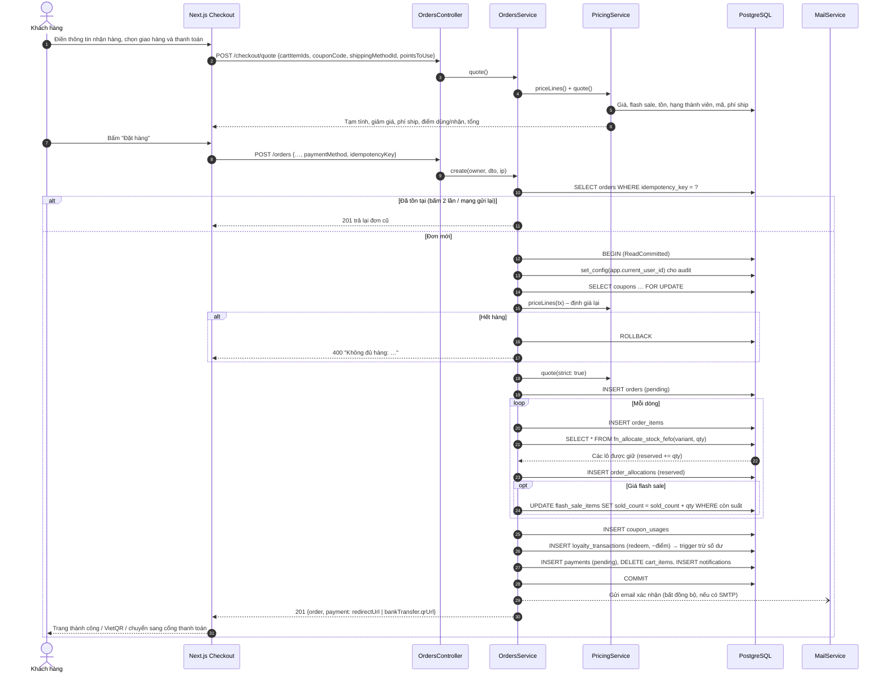

# Sơ đồ tuần tự – Đặt hàng

Căn cứ: `checkout.tsx`; `orders.controller.ts`, `orders.service.ts` (`create`, `placeOrder`), `pricing.service.ts`, `carts.service.ts`, hàm `fn_allocate_stock_fefo`.

```mermaid
sequenceDiagram
  autonumber
  actor C as Khách hàng
  participant FE as Next.js Checkout
  participant OC as OrdersController
  participant OS as OrdersService
  participant PS as PricingService
  participant DB as PostgreSQL
  participant Mail as MailService

  C->>FE: Điền thông tin nhận hàng, chọn giao hàng và thanh toán
  FE->>OC: POST /checkout/quote {cartItemIds, couponCode, shippingMethodId, pointsToUse}
  OC->>OS: quote()
  OS->>PS: priceLines() + quote()
  PS->>DB: Giá, flash sale, tồn, hạng thành viên, mã, phí ship
  PS-->>FE: Tạm tính, giảm giá, phí ship, điểm dùng/nhận, tổng
  C->>FE: Bấm "Đặt hàng"
  FE->>OC: POST /orders {…, paymentMethod, idempotencyKey}
  OC->>OS: create(owner, dto, ip)
  OS->>DB: SELECT orders WHERE idempotency_key = ?
  alt Đã tồn tại (bấm 2 lần / mạng gửi lại)
    OS-->>FE: 201 trả lại đơn cũ
  else Đơn mới
    OS->>DB: BEGIN (ReadCommitted)
    OS->>DB: set_config(app.current_user_id) cho audit
    OS->>DB: SELECT coupons … FOR UPDATE
    OS->>PS: priceLines(tx) – định giá lại
    alt Hết hàng
      OS->>DB: ROLLBACK
      OS-->>FE: 400 "Không đủ hàng: …"
    end
    OS->>PS: quote(strict: true)
    OS->>DB: INSERT orders (pending)
    loop Mỗi dòng
      OS->>DB: INSERT order_items
      OS->>DB: SELECT * FROM fn_allocate_stock_fefo(variant, qty)
      DB-->>OS: Các lô được giữ (reserved += qty)
      OS->>DB: INSERT order_allocations (reserved)
      opt Giá flash sale
        OS->>DB: UPDATE flash_sale_items SET sold_count = sold_count + qty WHERE còn suất
      end
    end
    OS->>DB: INSERT coupon_usages
    OS->>DB: INSERT loyalty_transactions (redeem, −điểm) → trigger trừ số dư
    OS->>DB: INSERT payments (pending), DELETE cart_items, INSERT notifications
    OS->>DB: COMMIT
    OS--)Mail: Gửi email xác nhận (bất đồng bộ, nếu có SMTP)
    OS-->>FE: 201 {order, payment: redirectUrl | bankTransfer.qrUrl}
    FE-->>C: Trang thành công / VietQR / chuyển sang cổng thanh toán
  end
```
